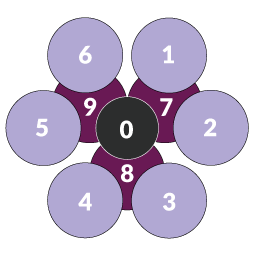
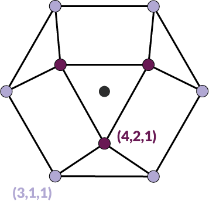

.. _background:
.. index:: Background

Background
==========

Common Neighbor Analysis
------------------------

The Common Neighbor Analysis (CNA) method is a pattern recognition algorithm for
single atoms. [1] A unique fingerprint is assigned to each atom
based on its atomic environment. It can act as an effective method to
distinguish between active sites and/or facets for crystalline systems.
[2] Various flavours of the CNA algorithm exist:

* **Conventional CNA**
    Based on a pre-fixed cut-off distance the neighbors for
    each atom are collected. This cut-off distance depends on the type of
    crystal lattice that one studies.
* **Adaptive CNA**
    Rather than specifying a fixed cut-off distance, in the
    adaptive algorithm the optimal cutoff radius is automatically determined
    for each individual particle. [3]
* **Interval CNA**
    When a suitable cutoff is challenging to determine using
    conventional or adaptive CNA, especially at high temperatures, the Interval
    Common Neighbor Analysis (i-CNA) method [4] can be
    employed. i-CNA examines all potential threshold choices for each particle,
    making it slower but achieving a higher recognition rate compared to other
    methods.
* **Bond-based CNA**
    Within this flavour the CNA is on the particle network's
    existing bonds, without considering particle distance or using a cutoff
    radius. To use this mode, particles must have pre-defined bonds.

.. note::
   :program:`Bramble` uses an **adaptive CNA** based on the implementation of
   Reinhart and coworkers [5]
   and first documented in the work of van Etten
   [6].

Within :program:`Bramble`, the cut-off distance for an atom is determined
based on the distances with the six nearest neighbors according to the
following equation

.. math::

   r_{\text{cut}} = \left( \frac{1 + \sqrt{2}}{2} \right)
   \left( \frac{1}{6} \sum_{j=1}^{6} | \vec{r}_{ij} | \right).

Based on this cut-off distance, all the neighbors of the atom are determined
and based on these atoms a binary adjacency matrix is constructed wherein each
element is a ``1`` if the distance between those atoms is smaller than
:math:`r_{\text{cut}}` or a ``0`` otherwise. This adjacency matrix is essentially
a representation of the neighborhood graph between the atoms. For each node in
this neighborhood graph a triplet of values, i.e. the so-called CNA
indices, is assigned. These indices are:

1. The number of nearest neighbor nodes.
2. The number of edges connecting those nodes to each other.
3. The length of the longest continuous path among those edges.

Finally, the indices of each node are collected and a fingerprint is constructed
based on how many times each CNA triplet is found within the graph.

We here provide an example for an atom at the FCC(111) termination. Such
an atom has 9 neighbors based on the value of :math:`r_{\text{cut}}`.
A schematic representation of this geometry is given below.

    Schematic depiction of an FCC(111) type of atom with its nearest
    neighbors.

Based on this structure, the following binary (boolean) adjacency graph
can be constructed

.. math::

    \textbf{M} = \left(
    \begin{matrix}
        - & 1 & 0 & 0 & 0 & 1 & 1 & 0 & 0 \\
        1 & - & 1 & 0 & 0 & 0 & 1 & 0 & 0 \\
        0 & 1 & - & 1 & 0 & 0 & 0 & 1 & 0 \\
        0 & 0 & 1 & - & 1 & 0 & 0 & 1 & 0 \\
        0 & 0 & 0 & 1 & - & 1 & 0 & 0 & 0 \\
        1 & 0 & 0 & 0 & 1 & - & 0 & 1 & 1 \\
        1 & 1 & 0 & 0 & 0 & 0 & - & 1 & 1 \\
        0 & 0 & 1 & 1 & 0 & 0 & 1 & - & 1 \\
        0 & 0 & 0 & 0 & 1 & 1 & 1 & 1 & -
    \end{matrix}
    \right)

which essentially represents the graph as found in the image below. In this graph,
we can readily observe two types of atoms. One type of atom (node; deep purple) has
four neighboring nodes. Among these four neighboring nodes, we can find two
connecting edges. Finally, the longest path among these nodes is one. Thus,
this atom has the triplet (4,2,1). Another type of atom, shaded in a lighter
purple, has only three neighboring nodes. Among these neighboring nodes, only
a single edge is shared and the longest continuous pathway along these nodes
is one. Thus, these atoms have the triplet (3,1,1).

    Neighborhood graph of an FCC(111) atom. There are two types of atoms,
    one type with (4,2,1) CNA indices and another type with (3,1,1) CNA
    indices.

.. note::
   There is no strict convention on how the multiplets of CNA indices are ordered
   in the fingerprint construction. :program:`Bramble` orders them in
   descending fashion based on the string representation of the CNA triplet.
   For example, ``(4,2,2)`` precedes ``(4,2,1)``. In this ordering, the
   multiplicity, i.e. the number of atoms having a particular CNA triplet, is
   **not** used.

We can readily observe that there 3 atoms with the (4,2,1) triplet and 6
atoms with the (3,1,1) triplet. This would then yield a CNA signature
of ``3(4,2,1)6(3,1,1)``. Below, a list of CNA patterns is given for very common
surface terminations and bulk atoms is given.

.. list-table:: CNA pattern for some common crystal motifs.
   :header-rows: 1

   * - Structure
     - CNA pattern
   * - FCC bulk
     - 12(4,2,1)
   * - HCP bulk
     - 6(4,2,2)6(4,2,1)
   * - FCC(111)
     - 3(4,2,1)6(3,1,1)
   * - FCC(100)
     - 4(4,2,1)4(2,1,1)

.. warning::
   Different program might adopt different CNA triplet sorting routines and/or
   different cut-off distances. It is expected that CNA patterns are similar
   between different programs, but no such guarantee can be given. Always
   critically check upon the underlying algorithm when comparing the CNA
   patterns between different programs.

Similarity Analysis
-------------------

Similarity analysis is done in :program:`Bramble` by means of calculating
the minimum `Hilbert-Schmidt norm <https://mathworld.wolfram.com/Hilbert-SchmidtNorm.html>`_.
Consider the distance matrix of the nearest
neighbors of two atoms which are to be compared. These distance matrices are
based on those neighboring atoms which have a distance less than the cutoff
distance as defined above.

To determine the similarity between the two atoms, the following value is
calculated

.. math::

   \mu_{kl} = \min_{P} \left( \sqrt{\sum_{ij} \left|\mathbf{D}_{ij}^{(k)} - \mathbf{D}_{ij}^{(l)}\right|^{2}} \right)

wherein the minimum is determined for all permutations :math:`P` for a given
matrix and wherein :math:`\mathbf{D}_{ij}^{(k)}` and :math:`\mathbf{D}_{ij}^{(l)}`
are the distance matrices of the neighboring atoms of atoms :math:`k` and
:math:`l`, respectively.

Because establishing the minimum Hilbert-Schmidt norm is inherently tied to
a graph isomorphism problem, :program:`Bramble` executes a brute-force technique
to probe all possible permutations :math:`P` to ensure that the minimum is found.

**References**

1. *Molecular dynamics study of melting and freezing of small Lennard-Jones
   clusters*, Honeycutt, J.D., Andersen, H.C., J. Phys. Chem., **1987**, 91, 19,
   4950-4963, DOI: `10.1021/j100303a014 <https://doi.org/10.1021/j100303a014>`_.
2. *Systematic analysis of local atomic structure combined with 3D computer
   graphics*, Faken, D., Jónsson, H., Comp. Mat. Sci., **1994**, 2, 2,
   279-286, DOI: `10.1016/0927-0256(94)90109-0 <https://doi.org/10.1016/0927-0256(94)90109-0>`_
3. *Structure identification methods for atomistic simulations of crystalline materials*,
   Modelling Simul. Mater. Sci. Eng. , Stukowski, A., **2012**, 20, 045021,
   DOI: `10.1088/0965-0393/20/4/045021 <https://doi.org/10.1088/0965-0393/20/4/045021>`_
4. *Revisiting the Common Neighbour Analysis and the Centrosymmetry Parameter*,
   arXiv, `2003.08879 <https://arxiv.org/abs/2003.08879>`_
5. *Machine learning for autonomous crystal structure identification*,
   Reinhard, W.F., Long, A.W., Howard, M.P., Ferguson, A.L.,
   Panagiotopoulos, A.Z., Soft Mat., **2017**, 13, 27, 4733-4745,
   DOI: `10.1039/c7sm00957g <https://doi.org/10.1039/c7sm00957g>`_
6. *Enumerating Active Sites on Metal Nanoparticles: Understanding the Size
   Dependence of Cobalt Particles for CO Dissociation*, van Etten M.P.C.,
   Zijlstra B., Hensen E.J.M., Filot, I.A.W., ACS Catal., **2021**, 11, 14,
   8484-8492, DOI: `10.1021/acscatal.1c00651 <https://doi.org/10.1021/acscatal.1c00651>`_.
