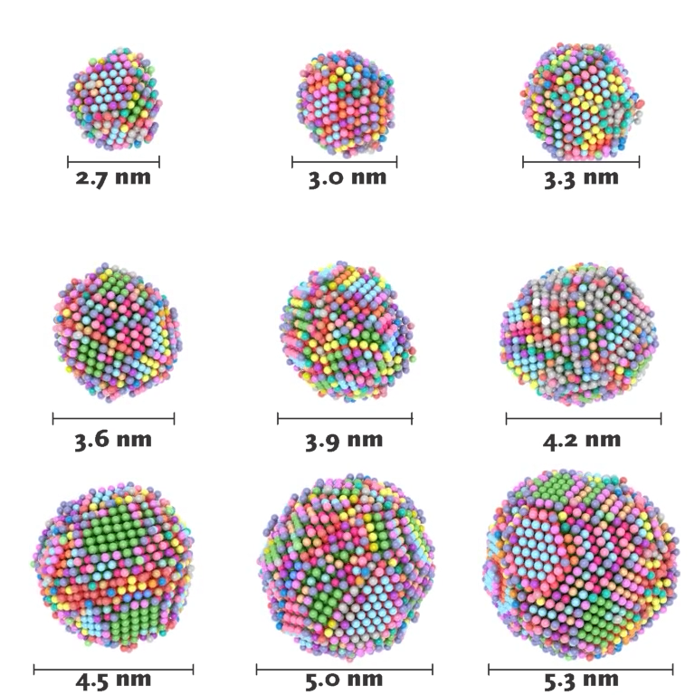

.. _examples:
.. index:: Examples

Examples
========

    Common Neighbor Analysis based pattern recognition of the surface
    atoms of cobalt nanoparticles of varying size. Details of this work
    can be found in the `publication <https://pubs.acs.org/doi/10.1021/acscatal.1c00651>`_.

..  youtube:: 9P0frhULKpw
