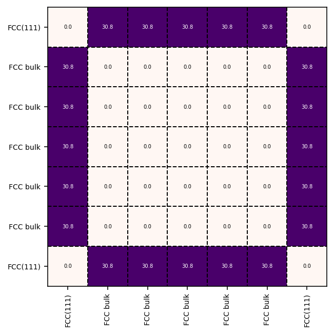

.. _examples:
.. index:: Examples

Examples
========

On this page, you can find a series of working examples to get acquainted with
the functionality of :program:`Bramble`.

.. note::
    Note that all code snippets assume that :program:`Bramble` has been
    built in a separate ``build`` folder as per the
    :ref:`installation instructions <installation>`.

Rh FCC111
---------

The following code is used to run this example::

     ./build/bramble -p patterns/patterns.json -i src/test/data/POSCAR_Rh111 -o pa_fcc111.txt

The statistics block after the CNA pattern recognition process looks as follows::

    Statistics
    ----------------------------------------------------------------------------------------------------
     #atom    perc      pattern fingerprint
    ----------------------------------------------------------------------------------------------------
         5  71.43%     FCC bulk 12(4,2,1)
         2  28.57%     FCC(111) 3(4,2,1)6(3,1,1)
    ----------------------------------------------------------------------------------------------------

Co HCP 11-21
------------

The following code is used to run this example::

     ./build/bramble -p patterns/patterns.json -i src/test/data/POSCAR_Co1121 -o pa_co1121.txt

The statistics block after the CNA pattern recognition process looks as follows::

    Statistics
    ----------------------------------------------------------------------------------------------------
     #atom    perc      pattern fingerprint
    ----------------------------------------------------------------------------------------------------
        16  33.33%     HCP bulk 6(4,2,2)6(4,2,1)
         8  16.67%   HCP(11-21) 1(4,2,2)1(4,2,1)1(3,2,2)2(3,1,1)1(3,0,0)1(2,1,1)1(2,0,0)
         8  16.67%   HCP(11-21) 3(4,2,2)4(4,2,1)1(3,2,2)2(3,1,1)1(3,0,0)
         8  16.67%   HCP(11-21) 3(4,2,2)2(4,2,1)1(3,2,2)3(3,1,1)1(2,0,0)
         8  16.67%   HCP(11-21) 1(4,2,2)1(3,2,2)1(3,1,1)1(2,1,1)2(2,0,0)
    ----------------------------------------------------------------------------------------------------

Clearly, we can see that all atoms are correctly identified. The majority of the
periodic unit cell is made up of bulk HCP atoms. The different types or surface
atoms are automatically recognized.

.. figure:: _static/img/similarity_analysis_co1121.png
    :align: center
