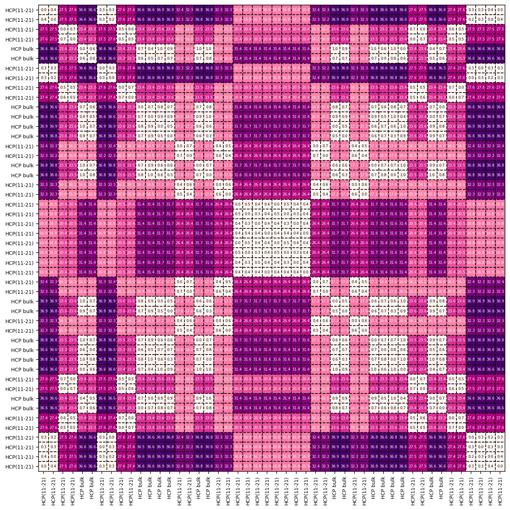

.. _examples:
.. index:: Examples

Examples
========

On this page, you can find a series of working examples to get acquainted with
the functionality of :program:`Bramble`.

.. note::
    Note that all code snippets assume that :program:`Bramble` has been
    built in a separate ``build`` folder as per the
    :ref:`installation instructions <installation>`.

Rh FCC111
---------

The following code is used to run this example::

     ./build/bramble -p patterns/patterns.json -i src/test/data/POSCAR_Rh111 -o pa_fcc111.txt

In `pa_fcc111.txt`, the results as shown below can be found. We can readily see
that there :program:`Bramble` has identified two types of atoms corresponding
to surface atoms with a ``3(4,2,1)6(3,1,1)`` CNA fingerprint and bulk atoms with
a ``12(4,2,1)`` CNA fingerpint::

    ----------------------------------------------------------------------------------------------------
    #     atom           x             y             z   color       pattern  fingerprint
    ----------------------------------------------------------------------------------------------------
    0001  Rh      0.000000      0.000000     10.000000  49ade1      FCC(111)  3(4,2,1)6(3,1,1)
    0002  Rh      1.343503      0.775672     12.193931  0b3d05      FCC bulk  12(4,2,1)
    0003  Rh      0.000000      1.551344     14.387862  0b3d05      FCC bulk  12(4,2,1)
    0004  Rh      0.000000      0.000000     16.581793  0b3d05      FCC bulk  12(4,2,1)
    0005  Rh      1.343503      0.775672     18.775724  0b3d05      FCC bulk  12(4,2,1)
    0006  Rh      0.000000      1.551344     20.969656  0b3d05      FCC bulk  12(4,2,1)
    0007  Rh      0.000000      0.000000     23.163586  49ade1      FCC(111)  3(4,2,1)6(3,1,1)
    ----------------------------------------------------------------------------------------------------

The statistics block reflects this from which it can be seen that there are
in total 5 bulk atoms and 2 surface atoms in this structure to be recognized::

    Statistics
    ----------------------------------------------------------------------------------------------------
     #atom    perc      pattern fingerprint
    ----------------------------------------------------------------------------------------------------
         5  71.43%     FCC bulk 12(4,2,1)
         2  28.57%     FCC(111) 3(4,2,1)6(3,1,1)
    ----------------------------------------------------------------------------------------------------

We can continue the analysis by performing a similarity analysis on the slab
model by running::

    ./build/bramble -s -i src/test/data/POSCAR_Rh111 -o sa_fcc111.txt

The result of this similarity analysis is shown in the image below. From this
image we can readily see that both surface atoms are completely indentical
with respect to each other :math:`\mu_{ij} = 0.0`. The same can be said
about all the bulk atoms. In contrast, the minimized Hilbert-Schmidt norm
between the surface and bulk atoms amounts to :math:`\mu_{ij} = 30.8`.

Execution times
***************

To get an impression of typical execution times and the benefit of GPU
acceleration, we refer to the Table as seen below.

.. list-table:: Execution times for the Rh FCC111 example
   :widths: 50 50
   :header-rows: 1

   * - System
     - Execution time (averaged)
   * - Intel(R) Core(TM) i9-10900K (20 threads)
     - 172.58s
   * - Intel(R) Core(TM) i9-10900K (20 threads) + RTX 4090
     - 90.18s
   * - Intel(R) Core(TM) i5-8400 (6 threads)
     - 311.84s
   * - Intel(R) Core(TM) i5-8400 (6 threads) + RTX 2070
     - 125.08s
   * - Intel(R) Xeon(R) Platinum 8360Y (18 threads) + A100-SXM4-40GB
     - 147.06s
   * - Intel(R) Xeon(R) Platinum 8360Y (36 threads) + 2x A100-SXM4-40GB
     - 72.59s

Co HCP 11-21
------------

The following code is used to run this example::

     ./build/bramble -p patterns/patterns.json -i src/test/data/POSCAR_Co1121 -o pa_co1121.txt

The Co11-21 slab model contains 48 atoms which are all recognized by the CNA
algorithm. A detailed listing is given below::

    ----------------------------------------------------------------------------------------------------
    #     atom           x             y             z   color       pattern  fingerprint
    ----------------------------------------------------------------------------------------------------
    0001  Co      3.810546     -0.660171      7.610554  a72424    HCP(11-21)  1(4,2,2)1(3,2,2)1(3,1,1)1(2,1,1)2(2,0,0)
    0002  Co      3.740586      4.073047      7.709530  a72424    HCP(11-21)  1(4,2,2)1(3,2,2)1(3,1,1)1(2,1,1)2(2,0,0)
    0003  Co      1.976955      0.571096      8.648905  a72424    HCP(11-21)  3(4,2,2)2(4,2,1)1(3,2,2)3(3,1,1)1(2,0,0)
    0004  Co      1.897765      5.352941      8.661025  a72424    HCP(11-21)  3(4,2,2)2(4,2,1)1(3,2,2)3(3,1,1)1(2,0,0)
    0005  Co      0.189433      1.908735      9.902833  cd1212      HCP bulk  6(4,2,2)6(4,2,1)
    0006  Co      0.168029      6.645793      9.926156  cd1212      HCP bulk  6(4,2,2)6(4,2,1)
    0007  Co      7.684312     -2.686362      7.688474  a72424    HCP(11-21)  1(4,2,2)1(3,2,2)1(3,1,1)1(2,1,1)2(2,0,0)
    0008  Co      7.518976      2.095552      7.644121  a72424    HCP(11-21)  1(4,2,2)1(3,2,2)1(3,1,1)1(2,1,1)2(2,0,0)
    0009  Co      5.797700     -1.353450      8.664054  a72424    HCP(11-21)  3(4,2,2)2(4,2,1)1(3,2,2)3(3,1,1)1(2,0,0)
    0010  Co      5.751478      3.382846      8.712483  a72424    HCP(11-21)  3(4,2,2)2(4,2,1)1(3,2,2)3(3,1,1)1(2,0,0)
    0011  Co      4.012030     -0.065299      9.896270  cd1212      HCP bulk  6(4,2,2)6(4,2,1)
    0012  Co      4.004269      4.684700      9.936931  cd1212      HCP bulk  6(4,2,2)6(4,2,1)
    0013  Co      2.271563      1.265690     11.088835  cd1212      HCP bulk  6(4,2,2)6(4,2,1)
    0014  Co      2.239254      5.989902     11.086904  cd1212      HCP bulk  6(4,2,2)6(4,2,1)
    0015  Co      0.529500      2.573367     12.372792  a72424    HCP(11-21)  3(4,2,2)4(4,2,1)1(3,2,2)2(3,1,1)1(3,0,0)
    0016  Co      0.516629      7.332281     12.359231  a72424    HCP(11-21)  3(4,2,2)4(4,2,1)1(3,2,2)2(3,1,1)1(3,0,0)
    0017  Co      6.122317     -0.728325     11.085389  cd1212      HCP bulk  6(4,2,2)6(4,2,1)
    0018  Co      6.102395      4.034584     11.067144  cd1212      HCP bulk  6(4,2,2)6(4,2,1)
    0019  Co      4.395721      0.588033     12.250446  a72424    HCP(11-21)  3(4,2,2)4(4,2,1)1(3,2,2)2(3,1,1)1(3,0,0)
    0020  Co      4.352049      5.332994     12.380740  a72424    HCP(11-21)  3(4,2,2)4(4,2,1)1(3,2,2)2(3,1,1)1(3,0,0)
    0021  Co      2.608498      1.904113     13.446673  a72424    HCP(11-21)  1(4,2,2)1(4,2,1)1(3,2,2)2(3,1,1)1(3,0,0)1(2,1,1)1(2,0,0)
    0022  Co      2.617157      6.656903     13.369873  a72424    HCP(11-21)  1(4,2,2)1(4,2,1)1(3,2,2)2(3,1,1)1(3,0,0)1(2,1,1)1(2,0,0)
    0023  Co      6.386291     -0.061239     13.452359  a72424    HCP(11-21)  1(4,2,2)1(4,2,1)1(3,2,2)2(3,1,1)1(3,0,0)1(2,1,1)1(2,0,0)
    0024  Co      6.468642      4.640786     13.375854  a72424    HCP(11-21)  1(4,2,2)1(4,2,1)1(3,2,2)2(3,1,1)1(3,0,0)1(2,1,1)1(2,0,0)
    0025  Co      0.226813      3.631587      8.103227  a72424    HCP(11-21)  1(4,2,2)1(4,2,1)1(3,2,2)2(3,1,1)1(3,0,0)1(2,1,1)1(2,0,0)
    0026  Co      0.218154      8.351897      8.180027  a72424    HCP(11-21)  1(4,2,2)1(4,2,1)1(3,2,2)2(3,1,1)1(3,0,0)1(2,1,1)1(2,0,0)
    0027  Co      4.136333      1.659554      8.097541  a72424    HCP(11-21)  1(4,2,2)1(4,2,1)1(3,2,2)2(3,1,1)1(3,0,0)1(2,1,1)1(2,0,0)
    0028  Co      4.053981      6.430630      8.174046  a72424    HCP(11-21)  1(4,2,2)1(4,2,1)1(3,2,2)2(3,1,1)1(3,0,0)1(2,1,1)1(2,0,0)
    0029  Co      2.305811      2.962334      9.177108  a72424    HCP(11-21)  3(4,2,2)4(4,2,1)1(3,2,2)2(3,1,1)1(3,0,0)
    0030  Co      2.318682      7.676520      9.190669  a72424    HCP(11-21)  3(4,2,2)4(4,2,1)1(3,2,2)2(3,1,1)1(3,0,0)
    0031  Co      0.563748      4.270010     10.461065  cd1212      HCP bulk  6(4,2,2)6(4,2,1)
    0032  Co      0.596058      9.018898     10.462996  cd1212      HCP bulk  6(4,2,2)6(4,2,1)
    0033  Co      6.126902      1.010282      9.299454  a72424    HCP(11-21)  3(4,2,2)4(4,2,1)1(3,2,2)2(3,1,1)1(3,0,0)
    0034  Co      6.170574      5.738421      9.169159  a72424    HCP(11-21)  3(4,2,2)4(4,2,1)1(3,2,2)2(3,1,1)1(3,0,0)
    0035  Co      4.400305      2.326640     10.464510  cd1212      HCP bulk  6(4,2,2)6(4,2,1)
    0036  Co      2.667282     -1.110093     11.623743  cd1212      HCP bulk  6(4,2,2)6(4,2,1)
    0037  Co      4.420228      7.036831     10.482756  cd1212      HCP bulk  6(4,2,2)6(4,2,1)
    0038  Co      2.645878      3.626966     11.647067  cd1212      HCP bulk  6(4,2,2)6(4,2,1)
    0039  Co      0.937546      0.182760     12.888876  a72424    HCP(11-21)  3(4,2,2)2(4,2,1)1(3,2,2)3(3,1,1)1(2,0,0)
    0040  Co      0.858356      4.964604     12.900995  a72424    HCP(11-21)  3(4,2,2)2(4,2,1)1(3,2,2)3(3,1,1)1(2,0,0)
    0041  Co      6.518353     -3.086385     11.612969  cd1212      HCP bulk  6(4,2,2)6(4,2,1)
    0042  Co      6.510593      1.663614     11.653630  cd1212      HCP bulk  6(4,2,2)6(4,2,1)
    0043  Co      4.771145     -1.784530     12.837416  a72424    HCP(11-21)  3(4,2,2)2(4,2,1)1(3,2,2)3(3,1,1)1(2,0,0)
    0044  Co      4.724922      2.951765     12.885846  a72424    HCP(11-21)  3(4,2,2)2(4,2,1)1(3,2,2)3(3,1,1)1(2,0,0)
    0045  Co      3.003647     -0.497237     13.905779  a72424    HCP(11-21)  1(4,2,2)1(3,2,2)1(3,1,1)1(2,1,1)2(2,0,0)
    0046  Co      2.838310      4.284677     13.861425  a72424    HCP(11-21)  1(4,2,2)1(3,2,2)1(3,1,1)1(2,1,1)2(2,0,0)
    0047  Co      6.782037     -2.474732     13.840369  a72424    HCP(11-21)  1(4,2,2)1(3,2,2)1(3,1,1)1(2,1,1)2(2,0,0)
    0048  Co      6.712077      2.258486     13.939345  a72424    HCP(11-21)  1(4,2,2)1(3,2,2)1(3,1,1)1(2,1,1)2(2,0,0)
    ----------------------------------------------------------------------------------------------------

The statitics block contains a summary of the above data from which it can be
seen that this slab model contains 16 bulk atoms and 32 surface atoms of four
different types::

    Statistics
    ----------------------------------------------------------------------------------------------------
     #atom    perc      pattern fingerprint
    ----------------------------------------------------------------------------------------------------
        16  33.33%     HCP bulk 6(4,2,2)6(4,2,1)
         8  16.67%   HCP(11-21) 1(4,2,2)1(4,2,1)1(3,2,2)2(3,1,1)1(3,0,0)1(2,1,1)1(2,0,0)
         8  16.67%   HCP(11-21) 3(4,2,2)4(4,2,1)1(3,2,2)2(3,1,1)1(3,0,0)
         8  16.67%   HCP(11-21) 3(4,2,2)2(4,2,1)1(3,2,2)3(3,1,1)1(2,0,0)
         8  16.67%   HCP(11-21) 1(4,2,2)1(3,2,2)1(3,1,1)1(2,1,1)2(2,0,0)
    ----------------------------------------------------------------------------------------------------

Clearly, we can see that all atoms are correctly identified. The majority of the
periodic unit cell is made up of bulk HCP atoms. The different types or surface
atoms are automatically recognized.

Continuing the study by  performing a similarity analysis by running::

    ./build/bramble -s -i src/test/data/POSCAR_Co1121 -o sa_fcc111.txt

yields the result as shown in the image below. Comparing the image with the
CNA pattern per atom above, we can readily interpret this result. The light
squares inside the figure correspond to pairs of atoms which have the same
CNA fingerprint and are thus expected to have a very low :math:`\mu_{ij}` value.
Furthermore, we can readily see that surface atoms are much more similar to
each other as compared to bulk atoms. For example, surface atoms with the
``1(4,2,2)1(3,2,2)1(3,1,1)1(2,1,1)2(2,0,0)`` fingerprint have a
:math:`\mu_{ij} \approx 28` with surface atoms with a
``3(4,2,2)2(4,2,1)1(3,2,2)3(3,1,1)1(2,0,0)`` motif and :math:`\mu_{ij} \approx 17`
with surface atoms with a
``1(4,2,2)1(4,2,1)1(3,2,2)2(3,1,1)1(3,0,0)1(2,1,1)1(2,0,0)`` motif. In contrast, with respect
to bulk atoms, :math:`\mu_{ij} \approx 36` is found.

Execution times
***************

To get an impression of typical execution times and the benefit of GPU
acceleration, we refer to the Table as seen below.

.. list-table:: Execution times for the Co HCP 11-21 example
   :widths: 50 50
   :header-rows: 1

   * - System
     - Execution time (averaged)
   * - Intel(R) Core(TM) i9-10900K (20 threads)
     - 5207s
   * - Intel(R) Core(TM) i9-10900K (20 threads) + RTX 4090
     - 2368s
   * - Intel(R) Xeon(R) Platinum 8360Y (18 threads) + A100-SXM4-40GB
     - 2543s
   * - Intel(R) Xeon(R) Platinum 8360Y (36 threads) + 2x A100-SXM4-40GB
     - 1366s
   * - Intel(R) Core(TM) i5-8400 (6 threads) + RTX 2070
     - 2986s
   * - Intel(R) Xeon(R) Gold 6234 (16 threads) + A5000
     - 3912s
   * - Intel(R) Core(TM) i5-12400F (12 threads) + 1x GTX 1080 Ti
     - 2759s
   * - Intel(R) Core(TM) i5-12400F (12 threads) + 2x GTX 1080 Ti
     - 2067s
