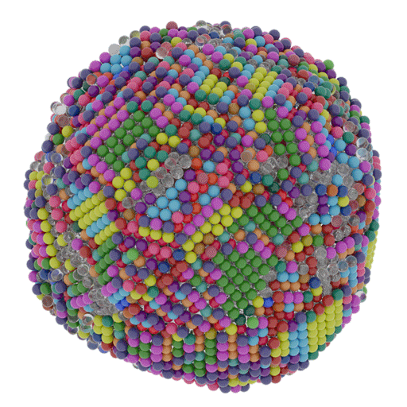

Bramble: Fast Common Neighbor Analysis
======================================

.. image:: https://img.shields.io/github/v/tag/ifilot/bramble?label=version
   :alt: GitHub tag (latest SemVer)
.. image:: https://github.com/ifilot/bramble/actions/workflows/build.yml/badge.svg
   :target: https://github.com/ifilot/bramble/actions/workflows/build.yml
.. image:: https://img.shields.io/badge/License-GPLv3-blue.svg
   :target: https://www.gnu.org/licenses/gpl-3.0
.. image:: https://joss.theoj.org/papers/f6493d619d92bb6d993713b9d1abb38c/status.svg
   :target: https://joss.theoj.org/papers/f6493d619d92bb6d993713b9d1abb38c
.. image:: https://zenodo.org/badge/641289155.svg
   :target: https://zenodo.org/badge/latestdoi/641289155

:program:`Bramble` is a single atom pattern recognition algorithm based on the
:ref:`Common Neighbor Analysis method <background>`. It can efficiently construct
:ref:`CNA fingerprints <background>` per atom and connect these fingerprints
to a (customizable) :ref:`pattern library <pattern_library>` to
add labels to the fingerprints. Example scripts are available for easy
visualization in `Matplotlib <https://matplotlib.org/>`_.

    Cobalt nanoparticle of 15625 atoms generated using a simulated annealing
    procedure. All colored atoms are identified by the CNA algorithm. The
    unknown atoms, i.e. atoms with an unknown CNA fingerprint, are rendered
    using a glass material. (source files can be found `here <https://github.com/ifilot/bramble/tree/master/scripts/blender>`_)

For fingerprints that are (still) unknown or for atoms that have a more
amorphous chemical environment, :program:`Bramble` comes bundled with a
similarity analysis tool. Although relatively computationally expensive to
execute, it yields a powerful similarity metric by which the extent that
two chemical environments are the same can be probed.

.. figure:: _static/img/similarity_analysis_co1121.png
    :align: center

    Similarity analysis of the atoms for a Co(1121) slab model

:program:`Bramble` has been developed at the Eindhoven University of Technology,
Netherlands. :program:`Bramble` and its development are hosted on `github
<https://github.com/ifilot/bramble>`_.  Bugs and feature
requests are ideally submitted via the `github issue tracker
<https://github.com/ifilot/bramble/issues>`_.

.. toctree::
   :maxdepth: 2
   :caption: Contents:

   installation
   background
   execution_model
   gallery
   user_interface
   examples
   pattern_library
   publications
   community_guidelines

Indices and tables
------------------

* :ref:`genindex`
* :ref:`search`
